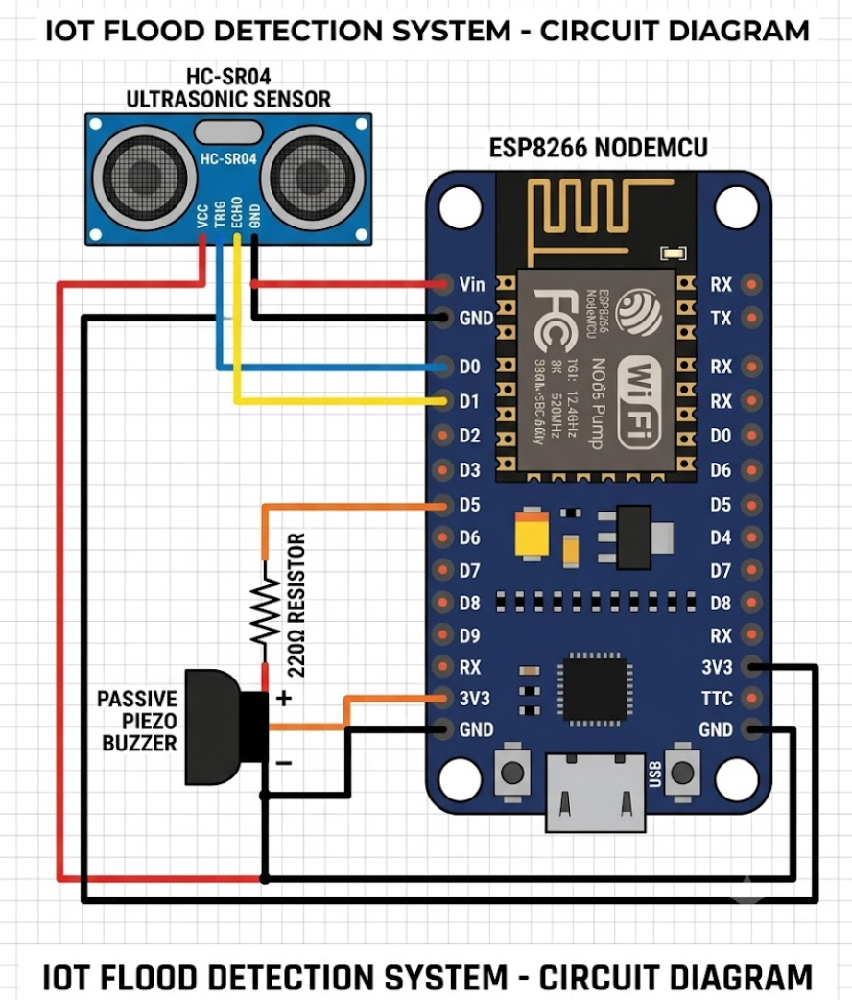

# 🌊 FloodWatch Pro: Advanced ESP8266 Flood Detection


FloodWatch Pro is a highly responsive, real-time IoT water level monitoring system. Built for the ESP8266 (NodeMCU) and the HC-SR04 ultrasonic sensor, it features advanced signal processing to eliminate false alarms and a stunning, retro-industrial web dashboard served directly from the ESP8266's flash memory.

## ✨ v3.0 Key Features

* **Advanced Signal Processing:** Uses an Exponential Moving Average (EMA) filter combined with outlier rejection and hysteresis. This ensures spurious sensor readings (ghost echoes) never trigger a false alarm.
* **Zero-Latency Web Audio Siren:** Browser audio alerts are generated dynamically using the Web Audio API (oscillators and LFOs) instead of downloading heavy `.mp3` files, ensuring instant alarm firing.
* **3-Tier Hysteresis Alert System:** Intelligently categorizes water levels (SAFE, WARNING, DANGER). Upgrading to a higher alert requires consecutive positive readings to prevent bouncing, while downgrading to SAFE is instantaneous.
* **Non-Blocking Architecture:** Built entirely without `delay()`. The HTTP server, sensor polling (200ms intervals), and hardware buzzer states run completely asynchronously.
* **Industrial Dashboard:** A beautifully designed, retro-tech web interface featuring a live SVG distance gauge, animated water tank simulation, dynamic history sparklines, and session statistics.

## 🛠️ Hardware Requirements

* 1x ESP8266 NodeMCU (ESP-12E)
* 1x HC-SR04 Ultrasonic Sensor
* 1x Passive Piezo Buzzer
* 1x 220Ω Resistor (for buzzer protection)
* Optional: 1kΩ & 2kΩ resistors (for an HC-SR04 Echo voltage divider)
* Breadboard & Jumper Wires (M-M, M-F)
* Micro-USB Data Cable

## 🔌 Circuit & Wiring

| Component / Pin | ESP8266 Pin | Notes |
| :--- | :--- | :--- |
| **HC-SR04 VCC** | **Vin (5V)** | The sensor requires 5V to operate reliably. |
| **HC-SR04 GND** | **GND** | Standard ground connection. |
| **HC-SR04 TRIG** | **D5 (GPIO 14)** | Sends the ultrasonic pulse. |
| **HC-SR04 ECHO** | **D6 (GPIO 12)** | *Note: The sensor outputs 5V on ECHO. While the ESP8266 is often 5V tolerant, using a voltage divider here is best practice.* |
| **Buzzer (+)** | **D7 (GPIO 13)** | Connect through a 220Ω resistor. |
| **Buzzer (-)** | **GND** | Standard ground connection. |



## 🚀 Installation & Setup

1. **Install the Arduino IDE** and ensure the ESP8266 board manager is configured.
2. **Clone this repository** to your local machine.
3. Open `src/FloodWatch_Pro.ino` in the Arduino IDE.
4. **Update Network Credentials:**
   ```cpp
   const char* WIFI_SSID     = "YOUR WIFI NAME";
   const char* WIFI_PASSWORD = "YOUR PASSWORD";
